# PayFlow — Platform Architecture Reference

> **Version:** 1.0 · **Status:** Living Document  
> **Audience:** Engineers, Architects, Product Managers, Stakeholders

---

## Table of Contents

1. [Platform Overview](#1-platform-overview)
2. [System Architecture](#2-system-architecture)
3. [Container & Service Map](#3-container--service-map)
4. [Payment Flow Lifecycle](#4-payment-flow-lifecycle)
5. [Routing Engine](#5-routing-engine)
6. [Provider Architecture](#6-provider-architecture)
7. [Database Architecture](#7-database-architecture)
8. [Security Architecture](#8-security-architecture)
9. [Applications & Responsibilities](#9-applications--responsibilities)
10. [UI/UX Workflow Documentation](#10-uiux-workflow-documentation)
11. [Infrastructure & Scalability](#11-infrastructure--scalability)
12. [Future Improvements](#12-future-improvements)

---

## 1. Platform Overview

PayFlow is a **multi-tenant payment orchestration platform** that enables merchants to route customer payments dynamically across multiple payment providers (Stripe, PayPal, and future adapters) with zero downtime failover, weighted traffic distribution, and rule-based conditional routing.

### Ecosystem Components

| Component | Technology | Port | Responsibility |
|---|---|---|---|
| **public-site** | Static HTML/Nginx | 8082 | Marketing website, contact sales |
| **saas-laravel** | Laravel 11 + Inertia + React | 80 | Merchant self-service dashboard |
| **admin-laravel** | Laravel 11 + Inertia + React | 8083 | Platform administration |
| **payments** | Python FastAPI | 8080 (via gateway) | Payment creation, routing, callbacks |
| **gateway** | Nginx | 8080 | Public API reverse proxy |
| **saas-gateway** | Nginx | 80 | SaaS app reverse proxy |
| **admin-gateway** | Nginx | 8083 | Admin app reverse proxy |
| **gateway-verification** | Node.js | internal | API key auth, rate-limiting middleware |
| **payments-db** | PostgreSQL 15 | internal | Payments, routing, credentials |
| **payments-logs-db** | PostgreSQL 15 | internal | Payment event logs (separate schema) |
| **redis** | Redis latest | internal | Health state cache, routing cache |
| **rabbitmq** | RabbitMQ 3 | 15672 (mgmt) | Async messaging, queue workers |
| **merchant-demo** | Static | 3001 | Reference merchant integration |

### Key Design Principles

- **Multi-tenancy**: Every credential, routing rule, and health signal is scoped to `merchant_id + environment`.
- **Provider-agnostic**: All providers implement a single `PaymentProviderAdapter` protocol. Adding a new provider requires one new file.
- **Credential isolation**: No shared provider keys. Each merchant connects their own Stripe/PayPal account.
- **Environment separation**: `test` and `live` environments are fully isolated at every layer.
- **Idempotency-first**: Every payment and provider call carries an idempotency key to prevent duplicate charges.
- **Shared database**: Laravel and FastAPI share the same PostgreSQL instance with no direct HTTP calls between them.

---

## 2. System Architecture

### Overall System Architecture

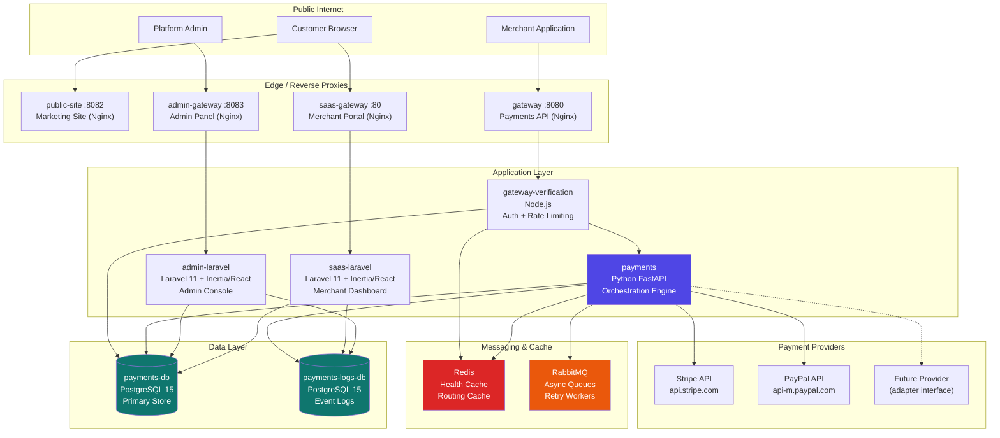

### Multi-Tenant Architecture

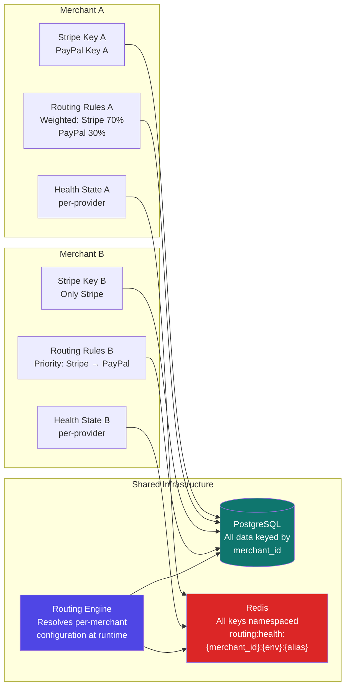

---

## 3. Container & Service Map

### Network Topology

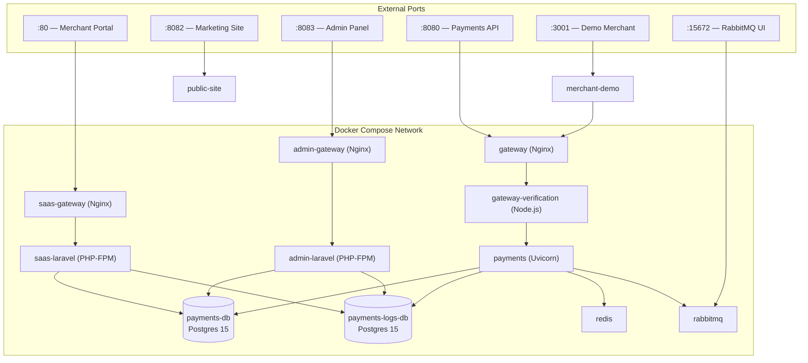

### Service Startup Order

```
rabbitmq, redis, payments-db, payments-logs-db  (infrastructure)
          ↓
       payments  (waits for all four to be healthy)
          ↓
  gateway, gateway-verification  (waits for payments healthy)
          ↓
  saas-laravel, admin-laravel  (waits for DBs healthy)
          ↓
  saas-gateway, admin-gateway  (waits for respective Laravel)
          ↓
  public-site, merchant-demo  (waits for gateway/saas-gateway)
```

---

## 4. Payment Flow Lifecycle

### Full End-to-End Payment Flow

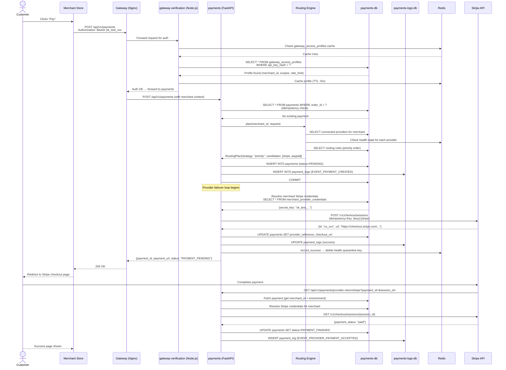

### Payment Status State Machine

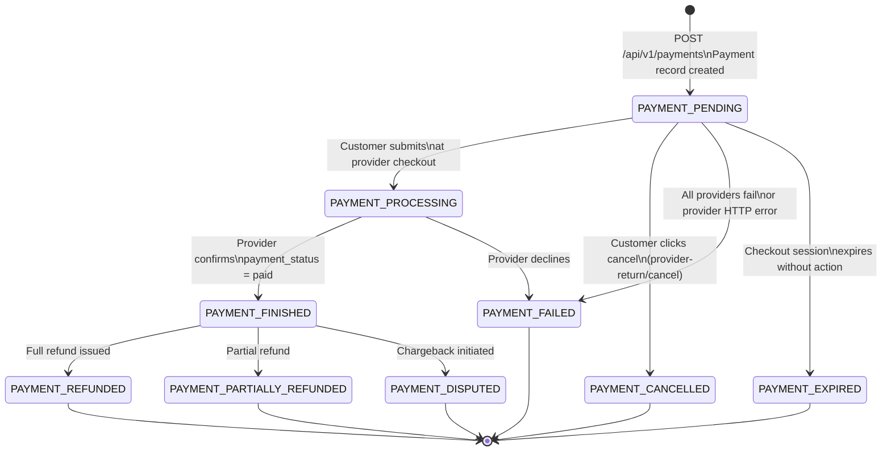

| Status Code | Name | Description |
|---|---|---|
| 1 | `PAYMENT_PENDING` | Created, awaiting provider checkout |
| 2 | `PAYMENT_FINISHED` | Successfully completed and captured |
| 3 | `PAYMENT_FAILED` | Provider declined or all providers failed |
| 4 | `PAYMENT_PROCESSING` | Customer submitted, awaiting provider confirmation |
| 5 | `PAYMENT_CANCELLED` | Cancelled by customer before capture |
| 6 | `PAYMENT_REFUNDED` | Full refund issued |
| 7 | `PAYMENT_PARTIALLY_REFUNDED` | Partial refund issued |
| 8 | `PAYMENT_DISPUTED` | Chargeback or dispute initiated |
| 9 | `PAYMENT_EXPIRED` | Session expired without action |

---

## 5. Routing Engine

### Routing Decision Waterfall

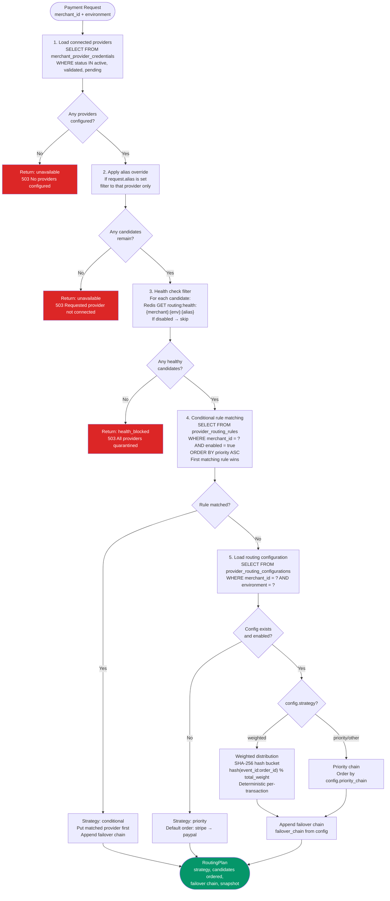

### Provider Failover Flow

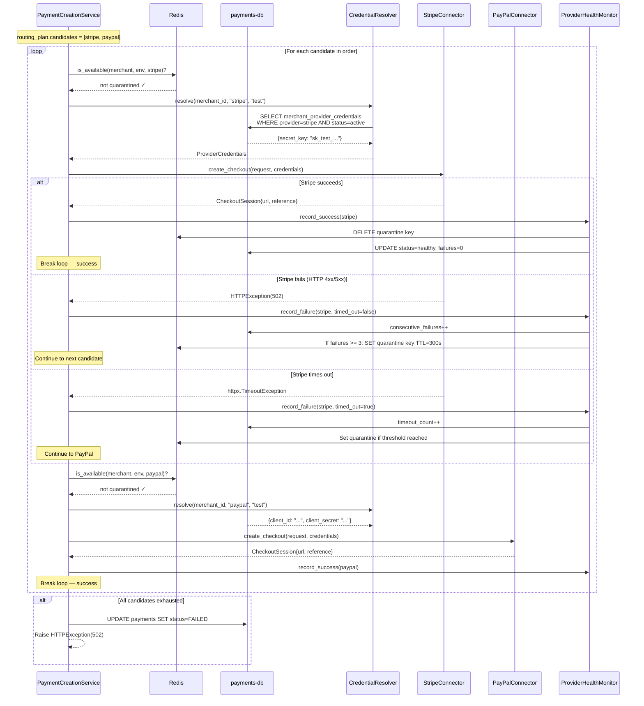

### Weighted Distribution Algorithm

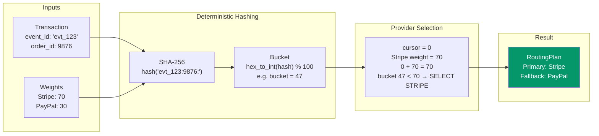

> **Key property:** The same `event_id + order_id` always routes to the same provider within a billing cycle. This ensures idempotent retries do not charge two providers.

### Conditional Rule Execution Order

```mermaid
flowchart TD
    Rules["Rules loaded from DB\nORDER BY priority ASC\ne.g. priority 10, 50, 100, 999"] --> R1

    R1{Rule priority=10\ncurrency='EUR'?}
    R1 -- request.currency != EUR --> R2
    R1 -- request.currency = EUR --> WIN1["Route to Stripe\n(EU provider)"]

    R2{Rule priority=50\nrecurring=true?}
    R2 -- not recurring --> R3
    R2 -- recurring=true --> WIN2["Route to Stripe\n(subscription provider)"]

    R3{Rule priority=100\nmin_amount=500?}
    R3 -- amount < 500 --> R4
    R3 -- amount >= 500 --> WIN3["Route to Stripe\n(high-value)"]

    R4{Rule priority=999\n(catch-all)?}
    R4 -- no match → falls through --> FALL["No conditional match\nFalls through to\nweighted / priority config"]
    R4 -- matches --> WIN4["Default provider"]

    style WIN1 fill:#059669,color:#fff
    style WIN2 fill:#059669,color:#fff
    style WIN3 fill:#059669,color:#fff
    style WIN4 fill:#059669,color:#fff
```

**Rule condition fields:**

| Field | Type | Example |
|---|---|---|
| `country` | string or list | `"US"` or `["US","CA"]` |
| `billing_country` | string or list | `"DE"` |
| `currency` | string or list | `"EUR"` |
| `card_type` | string or list | `"visa"` |
| `payment_method` | string | `"card"` |
| `recurring` | boolean | `true` |
| `min_amount` | decimal | `"100.00"` |
| `max_amount` | decimal | `"999.99"` |
| `channel` | string | `"web"` or `"mobile"` |
| `min_risk_score` | int 0–100 | `75` |
| `max_risk_score` | int 0–100 | `30` |

### Provider Health Monitoring

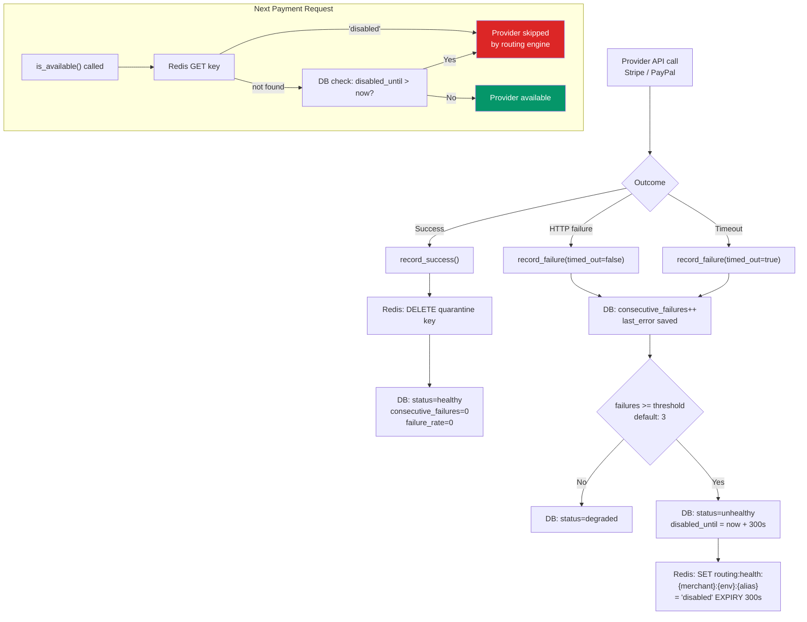

**Configuration:**

| Parameter | Env Var | Default |
|---|---|---|
| Failure threshold | `ROUTING_FAILURE_THRESHOLD` | `3` |
| Quarantine duration | `ROUTING_PROVIDER_QUARANTINE_SECONDS` | `300s` |
| Redis key pattern | — | `routing:health:{merchant_id}:{env}:{alias}` |

### Idempotency Flow

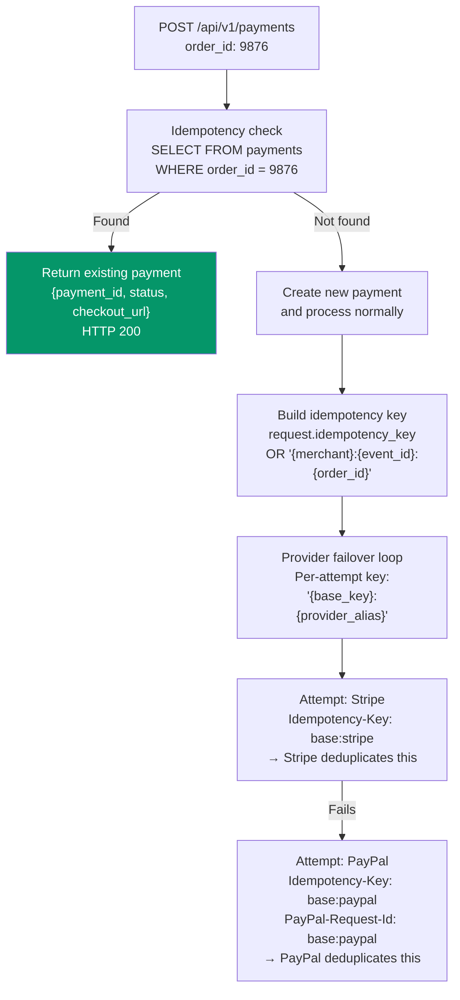

---

## 6. Provider Architecture

### Provider Adapter Pattern

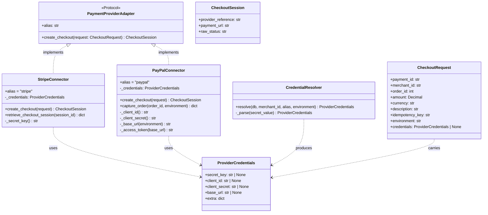

### Provider Registry

```python
# payments/app/providers/registry.py
_REGISTRY: dict[str, Type] = {
    "stripe": StripeConnector,
    "paypal": PayPalConnector,
    # "new_provider": NewProviderConnector  ← adding a provider = one line
}

def provider_connector(alias: str, credentials: ProviderCredentials | None = None):
    return _REGISTRY[alias.lower()](credentials=credentials)
```

**To add a new provider:**
1. Create `payments/app/providers/new_provider.py` implementing `PaymentProviderAdapter`
2. Add one entry to `_REGISTRY` in `registry.py`
3. Add return URL handling in `routes/webhooks.py`
4. Register the provider in the `providers` DB table

### Credential Resolution Flow

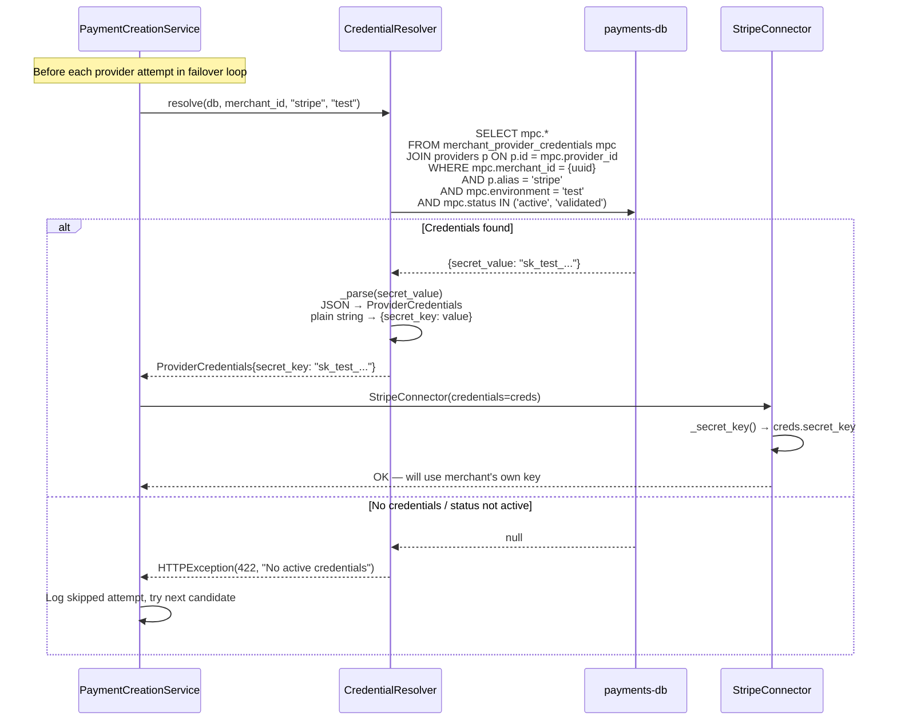

### Sandbox vs Live Separation

| Layer | Test Mode | Live Mode |
|---|---|---|
| API Key | `environment = 'test'` | `environment = 'live'` |
| Credentials | Separate row in `merchant_provider_credentials` | Separate row |
| PayPal URL | `api-m.sandbox.paypal.com` | `api-m.paypal.com` |
| Stripe | Uses test API keys (`sk_test_...`) | Uses live keys (`sk_live_...`) |
| Health state | Namespaced: `routing:health:{id}:test:{alias}` | `routing:health:{id}:live:{alias}` |
| Routing rules | `WHERE environment = 'test'` | `WHERE environment = 'live'` |
| Dashboard filter | Toggle between Test/Live views | |

---

## 7. Database Architecture

### Entity Relationship Overview

```mermaid
erDiagram
    users {
        UUID id PK
        VARCHAR name
        VARCHAR email UK
        SMALLINT status "1=active 2=inactive"
        SMALLINT role "1=admin 2=merchant"
    }

    subscriptions {
        UUID id PK
        VARCHAR name UK
        VARCHAR code UK
        NUMERIC monthly_fee
        NUMERIC transaction_fee_percent
        NUMERIC transaction_fee_fixed
        BIGINT included_transactions
    }

    user_subscriptions {
        UUID id PK
        UUID user_id FK
        UUID subscription_id FK
        BIGINT current_period_transactions
        NUMERIC current_period_volume
        SMALLINT status "1=active 2=inactive"
    }

    merchant_api_keys {
        UUID id PK
        VARCHAR hash UK
        VARCHAR key_prefix
        UUID merchant_id FK
        VARCHAR name
        VARCHAR environment "test|live"
        SMALLINT status
        JSONB scopes
        TIMESTAMPTZ last_rotated_at
        TIMESTAMPTZ revoked_at
    }

    gateway_access_profiles {
        UUID id PK
        VARCHAR api_key_hash UK
        UUID merchant_id FK
        VARCHAR merchant_name
        SMALLINT merchant_status
        SMALLINT api_key_status
        UUID subscription_id FK
        JSONB permissions
        JSONB allowed_routes
        JSONB allowed_providers
        INTEGER rate_limit_per_minute
    }

    providers {
        UUID id PK
        VARCHAR name
        VARCHAR alias UK "stripe|paypal"
        VARCHAR url
    }

    merchant_provider_credentials {
        UUID id PK
        UUID merchant_id FK
        UUID provider_id FK
        VARCHAR environment "test|live"
        VARCHAR display_name
        VARCHAR public_key
        TEXT secret_value "JSON or plain key"
        VARCHAR status "pending|active|validated|disabled"
        TIMESTAMPTZ last_validated_at
        TIMESTAMPTZ last_rotated_at
    }

    payments {
        UUID id PK
        UUID merchant_id FK
        UUID provider_id FK
        BIGINT order_id UK
        NUMERIC price
        NUMERIC amount
        VARCHAR provider_reference
        VARCHAR provider_checkout_url
        VARCHAR environment
        VARCHAR routing_strategy
        VARCHAR idempotency_key
        JSONB routing_metadata
        SMALLINT status
    }

    provider_routing_configurations {
        UUID id PK
        UUID merchant_id FK
        VARCHAR environment
        VARCHAR strategy "priority|weighted"
        BOOLEAN enabled
        JSONB priority_chain
        JSONB failover_chain
        JSONB weighted_distribution
    }

    provider_routing_rules {
        UUID id PK
        UUID merchant_id FK
        VARCHAR name
        VARCHAR environment
        VARCHAR provider_alias
        SMALLINT priority
        BOOLEAN enabled
        JSONB conditions
    }

    provider_health_statuses {
        UUID id PK
        UUID merchant_id FK
        UUID provider_id FK
        VARCHAR provider_alias
        VARCHAR environment
        VARCHAR status "healthy|degraded|unhealthy"
        INTEGER consecutive_failures
        INTEGER timeout_count
        TIMESTAMPTZ disabled_until
        TEXT last_error
    }

    payment_routing_attempts {
        UUID id PK
        UUID payment_id FK
        UUID merchant_id FK
        VARCHAR provider_alias
        VARCHAR strategy
        SMALLINT attempt_number
        VARCHAR status "succeeded|failed|timeout|skipped"
        INTEGER latency_ms
        TEXT error_code
        TEXT error_message
        JSONB routing_snapshot
    }

    routing_workflows {
        UUID id PK
        UUID merchant_id FK
        VARCHAR name
        VARCHAR environment
        VARCHAR status "draft|published"
        INTEGER current_version
        JSONB nodes
        JSONB edges
        JSONB validation_errors
    }

    routing_workflow_versions {
        UUID id PK
        UUID workflow_id FK
        INTEGER version
        VARCHAR status
        JSONB nodes
        JSONB edges
        TIMESTAMPTZ published_at
    }

    routing_audit_logs {
        UUID id PK
        UUID actor_id FK
        UUID merchant_id FK
        VARCHAR actor_type
        VARCHAR action
        JSONB before
        JSONB after
    }

    api_requests {
        UUID id PK
        VARCHAR event_id UK
        UUID payment_id FK
        UUID subscription_id FK
        UUID user_id FK
        NUMERIC amount
        VARCHAR source
    }

    users ||--o{ user_subscriptions : "has"
    subscriptions ||--o{ user_subscriptions : "belongs to"
    users ||--o{ merchant_api_keys : "owns"
    merchant_api_keys ||--|| gateway_access_profiles : "synced to"
    users ||--o{ merchant_provider_credentials : "configures"
    providers ||--o{ merchant_provider_credentials : "used in"
    users ||--o{ payments : "creates"
    providers ||--o{ payments : "processes"
    users ||--o{ provider_routing_configurations : "configures"
    users ||--o{ provider_routing_rules : "defines"
    providers ||--o{ provider_health_statuses : "tracked in"
    payments ||--o{ payment_routing_attempts : "generates"
    users ||--o{ routing_workflows : "owns"
    routing_workflows ||--o{ routing_workflow_versions : "versioned as"
    payments ||--o{ api_requests : "audited in"
```

### Separate Logs Database Schema

The `payments-logs-db` contains the `payment_logs` table, isolated for operational scalability:

```sql
CREATE TABLE payment_logs (
    id          UUID PRIMARY KEY,
    payment_id  UUID NOT NULL,
    event_type  SMALLINT NOT NULL,   -- PaymentLogEvent enum
    status      SMALLINT NOT NULL,   -- LogStatus enum
    message     TEXT,
    payload     JSONB,
    created_at  TIMESTAMPTZ NOT NULL DEFAULT now()
);
```

**Event types:**

| Code | Event | Meaning |
|---|---|---|
| 1 | `EVENT_PAYMENT_CREATED` | Payment record created |
| 2 | `EVENT_PROVIDER_REQUEST_SENT` | Request dispatched to provider |
| 3 | `EVENT_PROVIDER_PAYMENT_ACCEPTED` | Provider webhook/return received |
| 4 | `EVENT_MERCHANT_NOTIFICATION_SENT` | Outbox message published |
| 5 | `EVENT_PAYMENT_CANCELLED` | Customer cancelled |
| 6 | `EVENT_PAYMENT_REFUNDED` | Refund issued |
| 7 | `EVENT_PAYMENT_EXPIRED` | Session expired |
| 8 | `EVENT_PAYMENT_DISPUTED` | Chargeback initiated |

---

## 8. Security Architecture

### API Authentication Flow

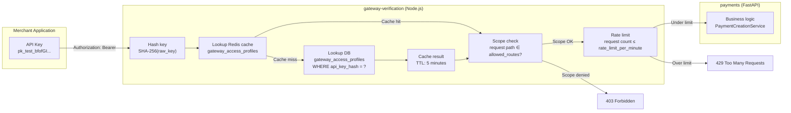

### Credential Security Model

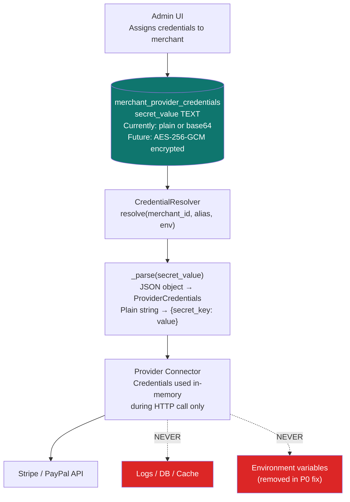

### Scope-Based Authorization

| Scope | FastAPI Endpoint | What it grants |
|---|---|---|
| `payments:create` | `POST /api/v1/payments` | Create checkout sessions |
| `payments:read` | `GET /api/v1/payments` | List and retrieve payments |
| `refunds:create` | `POST /api/v1/refunds` | Issue refunds against payments |
| `customers:read` | `GET /api/v1/customers` | Read customer profiles |
| `routing:test` | Routing validation endpoints | Test routing rules in sandbox |
| `webhooks:manage` | Webhook config endpoints | Register/update webhook URLs |

### Tenant Isolation Guarantees

| Resource | Isolation mechanism |
|---|---|
| Provider credentials | `WHERE merchant_id = ?` on every query |
| Routing configuration | `WHERE merchant_id = ? AND environment = ?` |
| Routing rules | Same — no cross-merchant rule inheritance |
| Health state (Redis) | Key prefix: `routing:health:{merchant_id}:...` |
| Health state (DB) | Unique constraint on `(merchant_id, provider_alias, environment)` |
| Payment records | `WHERE merchant_id = ?` enforced by auth header |
| API keys | Each key is scoped to one merchant, hashed before storage |
| Logs | `payment_id` is globally unique (UUID v7), cannot be guessed |

### Idempotency Design

```
Idempotency key hierarchy:

  Level 1 — Payment level
    key = request.idempotency_key
          OR "{merchant_id}:{event_id}:{order_id}"
    Protected by: UNIQUE constraint on payments.order_id

  Level 2 — Provider attempt level
    key = "{level_1_key}:{provider_alias}"
    Sent as: Idempotency-Key header to Stripe
             PayPal-Request-Id header to PayPal
    Result: provider deduplicates on their side too

  If both the platform AND the provider see the same key,
  the customer is never charged twice.
```

---

## 9. Applications & Responsibilities

### Responsibility Boundaries

```mermaid
graph TB
    subgraph "admin-laravel (Port 8083)"
        A1["Merchant CRUD\nCreate / suspend / edit"]
        A2["Provider management\nAssign Stripe/PayPal per merchant"]
        A3["API key generation\nRotate / revoke / scope"]
        A4["Routing workflow builder\nVisual node editor (React Flow)"]
        A5["Platform-wide analytics\nAll merchants / payments"]
        A6["Provider health monitoring\nGlobal health dashboard"]
        A7["Subscription plan management"]
        A8["Routing audit logs\nWho changed what"]
    end

    subgraph "saas-laravel (Port 80)"
        S1["Self-service dashboard\nMerchant's own data only"]
        S2["Payment history\nExport CSV / XLSX / JSON"]
        S3["Routing configuration\nPriority, weighted, rules"]
        S4["Provider health\nMerchant's providers only"]
        S5["API key management\nView own keys"]
        S6["Subscription management\nView plan, usage"]
        S7["Profile management\nName, email, password"]
    end

    subgraph "payments (Port 8080)"
        P1["Payment creation\nRouting + provider call"]
        P2["Provider callbacks\nStripe return / PayPal capture"]
        P3["Routing engine\nDecision logic"]
        P4["Health monitoring\nRecord + query state"]
        P5["Audit logging\nEvery routing attempt"]
        P6["Idempotency enforcement"]
    end

    subgraph "Shared (PostgreSQL)"
        DB[("payments-db\nAll three read/write same tables\nNo direct inter-service HTTP")]
    end

    A1 & A2 & A3 --> DB
    A4 & A5 & A6 --> DB
    S1 & S2 & S3 --> DB
    S4 & S5 & S6 --> DB
    P1 & P2 & P3 & P4 & P5 & P6 --> DB

    style DB fill:#0f766e,color:#fff
```

### Admin vs Merchant Capabilities

| Feature | Admin | Merchant |
|---|---|---|
| Create/edit merchants | ✓ | — |
| Suspend merchants | ✓ | — |
| Assign provider credentials | ✓ | — (self-service planned) |
| Generate API keys | ✓ | View own only |
| View all merchants' payments | ✓ | Own payments only |
| Configure routing (any merchant) | ✓ | Own routing only |
| Override routing rules | ✓ | — |
| Visual workflow builder | ✓ | Limited |
| Global health dashboard | ✓ | Own providers only |
| Platform analytics | ✓ | Own metrics only |
| Manage subscription plans | ✓ | View plan only |

### Gateway Verification Service

The `gateway-verification` Node.js service sits between Nginx and the FastAPI payments service:

1. **Receives** every inbound API request to `gateway:8080`
2. **Hashes** the `Authorization: Bearer` token (SHA-256)
3. **Checks Redis** for a cached `gateway_access_profiles` record
4. **Falls back to DB** on cache miss and caches the result for 5 minutes
5. **Validates** that the requested route is in `allowed_routes`
6. **Enforces** `rate_limit_per_minute`
7. **Forwards** to FastAPI with enriched headers (merchant context)

The FastAPI service **trusts** headers injected by gateway-verification and focuses purely on business logic.

---

## 10. UI/UX Workflow Documentation

### Merchant Onboarding Flow

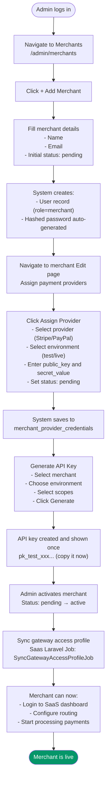

### Routing Workflow Builder UX (Admin)

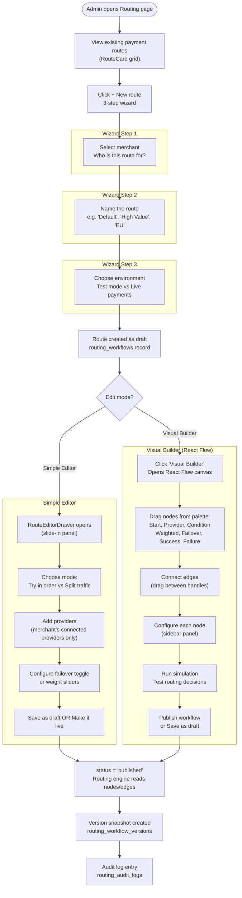

### Provider Configuration Flow (Merchant Self-Service)

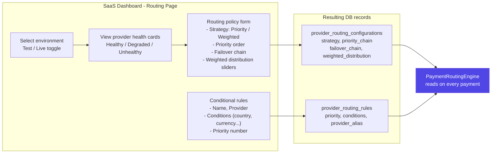

### CFO / Business User Workflow

```mermaid
flowchart TD
    CFO([CFO logs into SaaS Dashboard]) --> D1

    D1["Dashboard overview\nTotal payments / Volume / Success rate"] --> D2

    D2["Payments page\nFilter by: date range, status, provider"] --> D3

    D3["Export data\nCSV / XLSX / JSON for accounting"] --> D4

    D4["Routing page\nReview which provider handles what %"] --> D5

    D5["Adjust weights based on\n- Provider approval rates\n- Processing fees\n- Success metrics"] --> D6

    D6["Save routing policy\nChanges take effect immediately"] --> D7

    D7["Monitor provider health\nCheck for degraded processors"] --> End([Informed routing decision made])

    style End fill:#059669,color:#fff
```

---

## 11. Infrastructure & Scalability

### Redis Usage Map

| Key Pattern | Purpose | TTL |
|---|---|---|
| `routing:health:{merchant_id}:{env}:{alias}` | Provider quarantine flag | 300s (configurable) |
| `gateway_access_profiles:{hash}` | Auth cache in gateway-verification | 300s |
| *(planned)* `routing:config:{merchant_id}:{env}` | Routing config cache | 60s |
| *(planned)* `circuit:{merchant_id}:{env}:{alias}` | Connector-level circuit breaker | dynamic |

### RabbitMQ Queue Architecture

```mermaid
graph LR
    subgraph "Producers"
        API["FastAPI\npayments service"]
        Laravel["Laravel\njob dispatcher"]
    end

    subgraph "RabbitMQ Exchanges"
        DE["Default Exchange"]
    end

    subgraph "Queues (planned)"
        Q1["payments.retry\nAsync provider retry"]
        Q2["webhooks.outbox\nMerchant webhook delivery"]
        Q3["health.checks\nAsync health verification"]
        Q4["notifications\nEmail / Slack alerts"]
    end

    subgraph "Consumers"
        W1["Retry Worker\nExponential backoff"]
        W2["Webhook Worker\nOutbox pattern consumer"]
        W3["Health Worker\nPeriodic provider ping"]
    end

    API --> DE --> Q1 & Q2 & Q3
    Laravel --> DE --> Q4
    Q1 --> W1
    Q2 --> W2
    Q3 --> W3

    style DE fill:#ea580c,color:#fff
```

> **Current state:** RabbitMQ is connected at startup (lifecycle events in `main.py`). Queue-based async failover is a P1 improvement — currently failover is synchronous within the HTTP request lifecycle.

### Async Processing Roadmap

```mermaid
sequenceDiagram
    participant Merchant as Merchant App
    participant API as payments FastAPI
    participant Queue as RabbitMQ
    participant Worker as Retry Worker
    participant Provider as Stripe / PayPal
    participant DB as payments-db

    Note over API,Worker: Current (sync) — Proposed (async)

    Merchant->>API: POST /api/v1/payments
    API->>DB: INSERT payment status=PENDING
    API->>Queue: PUBLISH payments.process{payment_id}
    API-->>Merchant: 202 Accepted{payment_id}

    Note over Queue,Worker: Worker picks up job
    Worker->>DB: Load payment + routing plan
    Worker->>Provider: create_checkout()

    alt Provider succeeds
        Provider-->>Worker: checkout URL
        Worker->>DB: UPDATE status=PENDING, checkout_url=...
        Worker->>Queue: PUBLISH webhooks.notify{merchant_id, payment_id, checkout_url}
    else Provider fails
        Worker->>Queue: Re-queue with next candidate + exponential backoff
        Note over Worker: Attempt 1 → delay 5s<br/>Attempt 2 → delay 30s<br/>Attempt 3 → delay 2m
    end
```

### Caching Strategy

```mermaid
graph TD
    subgraph "Cache Layers"
        L1["L1: Redis\nIn-memory, O(1) reads\nHealth state: 300s TTL\nGateway auth: 300s TTL"]
        L2["L2: PostgreSQL\nPersistent, source of truth\nIndex-optimized queries\nRead on Redis miss"]
    end

    subgraph "Cache Invalidation"
        I1["Health: record_success()\n→ DELETE Redis key immediately"]
        I2["Health: record_failure() threshold\n→ SET Redis key TTL=quarantine_seconds"]
        I3["Gateway profile: API key rotation\n→ Increment cache_version\n→ Old cache evicted on next request"]
    end

    L1 --> L2
    I1 & I2 --> L1
    I3 --> L1
```

### Health Monitoring Dashboard Flow

```mermaid
flowchart LR
    subgraph "Data Sources"
        DB1["provider_health_statuses\nPersistent health history"]
        Redis1["Redis\nLive quarantine state"]
        DB2["payment_routing_attempts\nAttempt success/fail rates"]
    end

    subgraph "Admin Dashboard"
        Strip["StatusStrip\nSystem status · Live routes · Failed attempts"]
        Cards["ProviderHealthPanel\nPer-merchant health cards\nUnhealthy / Degraded / Healthy"]
        Activity["ActivityFeed\nLast 10 routing events + config changes"]
    end

    DB1 --> Cards
    Redis1 --> Cards
    DB2 --> Strip & Activity

    subgraph "Automated Response"
        Q["ProviderHealthMonitor"]
        Q --> A1["3 consecutive failures\n→ quarantine provider 5 min"]
        Q --> A2["Record success\n→ clear quarantine immediately"]
        Q --> A3["Timeout counted separately\n→ affects failure rate metric"]
    end
```

### Scalability Considerations

| Concern | Current approach | Scaling path |
|---|---|---|
| **Payment throughput** | Single FastAPI process (Uvicorn) | Add Gunicorn workers; scale `payments` container horizontally |
| **DB read load** | Direct queries per request | Add read replica; cache routing config in Redis |
| **DB write load** | Synchronous commits | Write to outbox table; async consumer writes to logs |
| **Provider failover latency** | Synchronous (blocks request 15s per timeout) | Move to async queue; return 202 Accepted immediately |
| **Health check accuracy** | Failure recorded after the call | Add pre-call circuit breaker at connector level |
| **Cache consistency** | Redis TTL-based eviction | Subscribe to DB change events (PostgreSQL LISTEN/NOTIFY) |
| **Multi-region** | Single region (Docker Compose) | Deploy payments API per region; shared DB in primary region |

---

## 12. Future Improvements

### Priority Roadmap

| Priority | Item | Impact |
|---|---|---|
| **P0** ✓ | Per-merchant credential resolution from DB | Security / Multi-tenancy |
| **P0** ✓ | Remove global provider fallback | Security / Correctness |
| **P1** | Async queue-based provider failover | Latency / Reliability |
| **P1** | Webhook outbox consumer (merchant notifications) | Payment status accuracy |
| **P1** | Wire `routing_workflows` graph to routing engine | Feature completeness |
| **P2** | `customer_id`, `billing_country`, `channel`, `risk_score` in request | Routing intelligence |
| **P2** | Full payment lifecycle states in UI (CANCELLED, REFUNDED) | Merchant UX |
| **P2** | Circuit breaker at connector level (pre-call) | Latency during degradation |
| **P3** | Encrypt `secret_value` at rest (AES-256-GCM or KMS) | Credential security |
| **P3** | Admin-controlled provider allowlist per merchant | Operational control |
| **P3** | Webhook retry queue with exponential backoff | Delivery reliability |
| **Future** | Additional provider adapters | Provider diversity |
| **Future** | Automatic reconciliation job (sync DB vs provider) | Data integrity |
| **Future** | Merchant-facing analytics charts (approval rates, latency) | Business intelligence |
| **Future** | A/B testing framework for provider comparison | Optimization |

### Webhook Outbox Pattern (P1)

```mermaid
sequenceDiagram
    participant Provider as Stripe / PayPal
    participant API as payments FastAPI
    participant DB as payments-db
    participant Worker as Outbox Worker
    participant Merchant as Merchant Webhook URL

    Provider->>API: GET /provider-return/stripe?payment_id=&session_id=
    API->>DB: UPDATE payments SET status=FINISHED
    API->>DB: INSERT payment_logs (EVENT_MERCHANT_NOTIFICATION_SENT, status=LOG_PENDING)
    API-->>Provider: 200 OK (redirect customer)

    Note over Worker: Polls LOG_PENDING rows

    Worker->>DB: SELECT * FROM payment_logs<br/>WHERE event_type=4 AND status=LOG_PENDING
    Worker->>Merchant: POST merchant_webhook_url {payment_id, status, amount}

    alt Webhook delivered
        Merchant-->>Worker: 200 OK
        Worker->>DB: UPDATE status=LOG_SUCCESS
    else Webhook fails
        Merchant-->>Worker: 5xx or timeout
        Worker->>DB: UPDATE status=LOG_RETRYING
        Note over Worker: Retry with exponential backoff<br/>Max 5 attempts → LOG_BLOCKED
    end
```

### Adding a New Payment Provider

```
1. Create: payments/app/providers/new_provider.py
   - class NewProviderConnector
   - implements: create_checkout(request) → CheckoutSession
   - reads credentials from request.credentials
   - no global env vars

2. Register: payments/app/providers/registry.py
   - _REGISTRY["new_provider"] = NewProviderConnector

3. Webhook route: payments/app/routes/webhooks.py
   - GET /provider-return/new-provider
   - GET /provider-return/new-provider/cancel

4. DB: Insert into providers table
   - ("new_provider", "New Provider", "https://new-provider.example")

5. Admin UI: Automatically appears in provider assignment
   (reads from providers table, no code change needed)

6. Done — merchant connects credentials → routing engine
   picks it up automatically via merchant_provider_credentials
```

---

## Appendix A: API Reference Summary

### Payment Endpoints

| Method | Path | Scope | Description |
|---|---|---|---|
| `POST` | `/api/v1/payments` | `payments:create` | Create payment + route to provider |
| `GET` | `/api/v1/payments` | `payments:read` | List merchant payments (paginated) |
| `GET` | `/api/v1/payments/{id}/show` | `payments:read` | Single payment details |
| `GET` | `/api/v1/payments/{id}/tracking` | `payments:read` | Payment event timeline |
| `GET` | `/api/v1/payments/provider-return/stripe` | — | Stripe success callback |
| `GET` | `/api/v1/payments/provider-return/stripe/cancel` | — | Stripe cancel callback |
| `GET` | `/api/v1/payments/provider-return/paypal` | — | PayPal capture callback |
| `GET` | `/api/v1/payments/provider-return/paypal/cancel` | — | PayPal cancel callback |
| `GET` | `/health` | — | Service health check |

### Payment Request Schema

```json
{
  "order_id": 1780059719540,
  "amount": 1,
  "price": "79.99",
  "currency": "USD",
  "country": "US",
  "billing_country": "US",
  "payment_method": "card",
  "card_type": "visa",
  "recurring": false,
  "environment": "test",
  "alias": null,
  "idempotency_key": "merchant-side-uuid",
  "customer_id": "cust_abc123",
  "channel": "web",
  "locale": "en-US",
  "risk_score": 12,
  "metadata": {
    "product_category": "electronics"
  },
  "subscription_id": "uuid-of-subscription",
  "event_id": "unique-event-identifier"
}
```

---

## Appendix B: Environment Variables

### payments service

| Variable | Default | Purpose |
|---|---|---|
| `DATABASE_URL` | — | PostgreSQL connection (payments-db) |
| `LOGS_DATABASE_URL` | — | PostgreSQL connection (payments-logs-db) |
| `REDIS_URL` | — | Redis connection |
| `RABBITMQ_URL` | — | RabbitMQ connection |
| `PAYMENT_RETURN_BASE_URL` | `http://localhost:8080/api/v1/payments` | Stripe/PayPal redirect URLs |
| `ROUTING_FAILURE_THRESHOLD` | `3` | Failures before quarantine |
| `ROUTING_PROVIDER_QUARANTINE_SECONDS` | `300` | Quarantine duration |

> **Removed (P0 fix):** `STRIPE_SECRET_KEY`, `PAYPAL_CLIENT_ID`, `PAYPAL_CLIENT_SECRET` are no longer used by the routing engine. Credentials are resolved per-merchant from the database at runtime.

---

*This document reflects the architecture as of June 2026. Update this file when making structural changes to the platform.*
