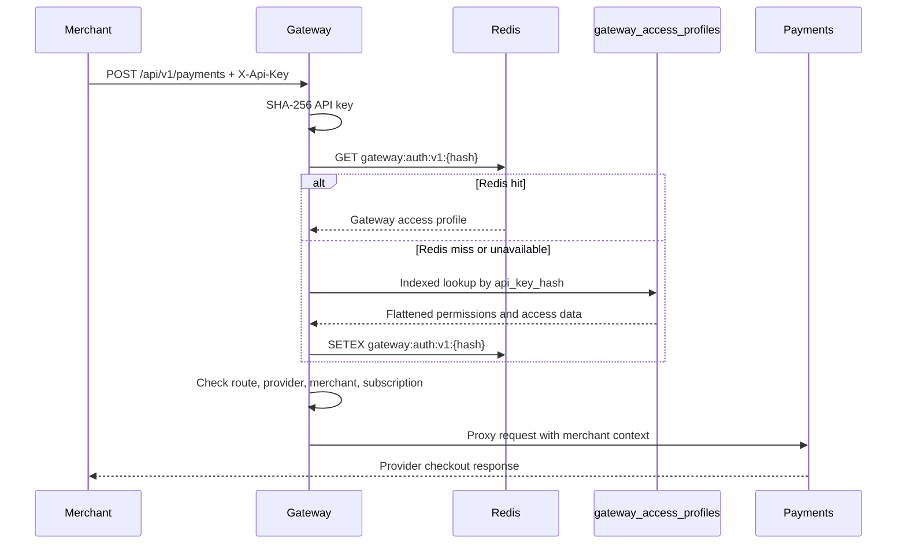

# Gateway Performance Architecture

## Objective

Reduce API Gateway database load by moving request-time authorization from normalized relational joins to a Redis-first, denormalized gateway access profile.

## Request Flow



## Database Read Model

`gateway_access_profiles` is a denormalized table optimized for gateway reads. It avoids joining `merchant_api_keys`, `users`, `user_subscriptions`, `subscriptions`, and `providers` during request execution.

Important columns:

- `api_key_hash`
- `merchant_id`, `merchant_status`, `merchant_role`
- `api_key_status`
- `subscription_id`, `subscription_name`, `subscription_code`, `subscription_status`
- `permissions`
- `allowed_routes`
- `allowed_providers`
- `rate_limit_per_minute`
- `cache_version`
- `synced_at`, `revoked_at`

Primary gateway lookup:

```sql
SELECT ...
FROM gateway_access_profiles
WHERE api_key_hash = $1
LIMIT 1;
```

## Redis Key Strategy

Positive profile cache:

```text
gateway:auth:v1:{sha256_api_key}
```

Negative cache:

```text
gateway:auth:v1:invalid:{sha256_api_key}
```

The gateway never stores plaintext API keys in Redis. It hashes the provided key and reads by hash.

## Synchronization

The SaaS app writes the read model when merchant access data changes:

- API key created, updated, or deleted
- user updated
- user subscription updated or deleted
- merchant registration assigns a default subscription

The sync workflow:

1. Rebuild gateway access profile from normalized SaaS tables.
2. Upsert `gateway_access_profiles`.
3. Write Redis `gateway:auth:v1:{hash}`.
4. Delete any negative cache entry.

If Redis is unavailable, the database profile is still updated. The gateway falls back to the DB profile and repopulates Redis later.

## Network and Runtime Considerations

- Node Postgres pool increased to 20 connections with keep-alive and fast connection timeout.
- Gateway HTTP proxy uses a keep-alive agent to reduce connection churn to the payments service.
- Redis failures no longer crash the gateway process.
- Circuit breaker fails open if Redis is unavailable, avoiding a total outage from cache failure.
- Route and provider checks happen before proxying to `payments`, reducing unnecessary internal calls.

## Production Scaling Notes

- Run multiple stateless `gateway-verification` instances behind a load balancer.
- Use Redis Cluster or managed Redis with persistence and monitoring.
- Set short negative-cache TTLs so newly created API keys become usable quickly.
- Add per-merchant rate limits using `rate_limit_per_minute`.
- Move profile rebuilds to queued jobs or outbox events for high-volume admin changes.
- Use service discovery or internal load balancing for `payments`.
- Keep provider webhooks asynchronous through RabbitMQ.
